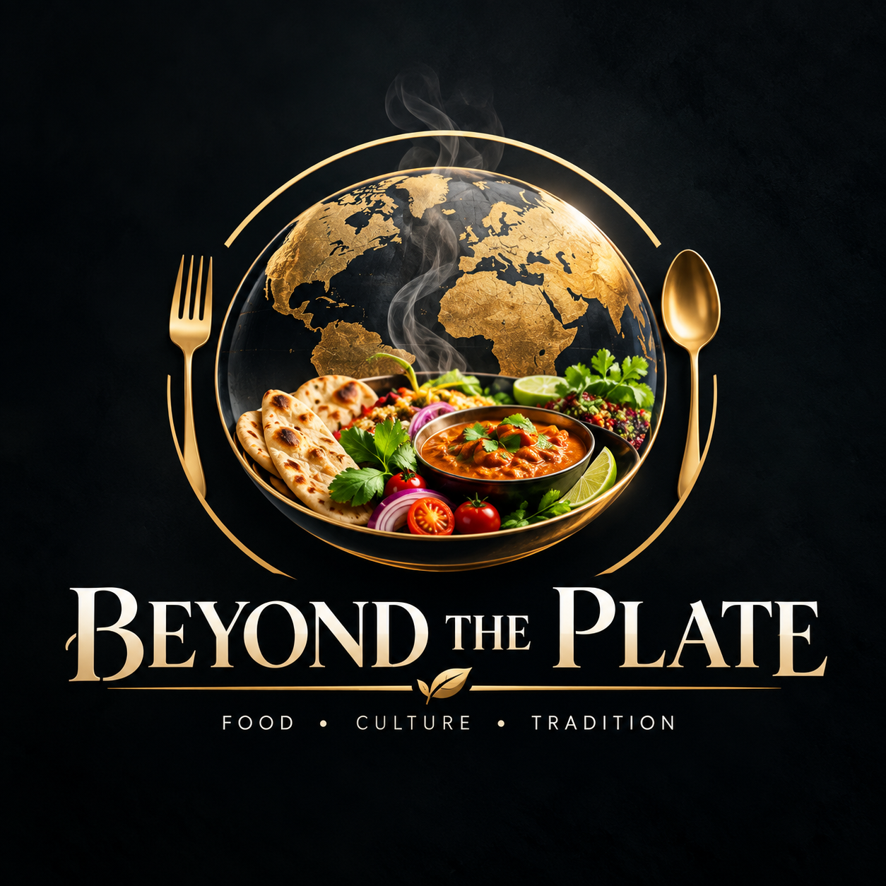

<p align="center">
  
</p>


<h1 align="center">Beyond The Plate</h1>

<p align="center">
  <strong><em>Every dish carries a history worth tasting.</em></strong><br/>
  Geography, memory, family and fire — served on a plate.
</p>

<p align="center">
  <a href="https://react.dev"></a>
  <a href="https://www.typescriptlang.org"></a>
  <a href="https://vitejs.dev"></a>
  <a href="https://tailwindcss.com"></a>
  <a href="https://motion.dev"></a>
  <a href="https://gsap.com"></a>
  <a href="https://github.com/darkroomengineering/lenis"></a>
  <a href="https://recharts.org"></a>
</p>

---

## About

**Beyond The Plate** is a digital museum for the world's food — not another recipe website. It documents **138 authentic dishes** from **49 countries across six continents**, and tells each one as a story worth sitting down for.

Where a normal recipe site stops at ingredients and timers, *Beyond The Plate* asks the questions that make food meaningful: *Where did this dish come from? Who first cooked it? What festival, geography, and family history are folded into every bite?*

Every dish in the collection is fully documented with:

- **History & significance** — where it was born and why it matters
- **Geography & culture** — the region, the people, the place
- **Festivals & tradition** — the ceremonies where food is the calendar
- **Authentic recipes** — step-by-step, with a live cooking timer
- **Full nutrition** — macros, vitamins, minerals, and a health score

> *"Every dish carries a history worth tasting. Geography, memory, family, and fire — served on a plate."*

**What makes it unique?** It is a cinematic, museum-inspired experience. A glassmorphic dark interface, editorial typography, and motion design that treats a bowl of soup the way an exhibition treats a painting — because every plate is a portrait of the people who made it.

---

## Features

- [x]  **138 authentic world dishes** — every one fully documented
- [x]  **49+ countries** — across six continents
- [x]  **Interactive recipes** — step-by-step guide with live cooking timer
- [x]  **Nutrition dashboard** — macros, vitamins, minerals, health score
- [x]  **Editorial storytelling** — history, significance, tradition for every dish
- [x]  **Culture exploration** — chapters and world festivals
- [x]  **Search** — instant dish / country / name lookup
- [x]  **Filters** — by country and by tag
- [x]  **Responsive design** — 320px → 1920px, zero overflow
- [x]  **Gallery** — curated photography with lightbox
- [x]  **Glassmorphism UI** — glass surfaces, soft shadows, film-grain texture
- [x]  **Dark premium interface** — gold, ink, and cream design system
- [x]  **Animations** — Framer Motion + GSAP
- [x]  **Scroll effects** — Lenis smooth scroll, parallax, Ken Burns pans
- [x]  **Accessibility** — keyboard navigation, ARIA, reduced motion
- [x]  **Modern design system** — tokens, keyframes, shared motion variants


---

## Tech Stack

| Layer | Technology |
| --- | --- |
| **Framework** | [React 19](https://react.dev) |
| **Language** | [TypeScript](https://www.typescriptlang.org) |
| **Styling** | [Tailwind CSS 4](https://tailwindcss.com) + custom design system |
| **Animation** | [Framer Motion](https://motion.dev) · [GSAP](https://gsap.com) · [Lenis](https://github.com/darkroomengineering/lenis) |
| **Icons** | [Lucide](https://lucide.dev) · [React Icons](https://react-icons.github.io/react-icons) |
| **Charts** | [Recharts](https://recharts.org) |
| **Routing** | [React Router 7](https://reactrouter.com) |
| **Build Tool** | [Vite 8](https://vitejs.dev) |
| **Linting** | [Oxlint](https://oxc.rs) |
| **Testing** | [Playwright](https://playwright.dev) (custom smoke + audit scripts) |
| **Deployment** | Any static host — Vercel, Netlify, GitHub Pages, Cloudflare Pages |

---

## Folder Structure

```
beyond-the-plate/
├── public/                        # static assets (favicon, icons, logo)
├── scripts/                       # verification harness
│   ├── smoke.mjs                  #   8-route render smoke test
│   └── audit.mjs                  #   45-check browser audit
├── src/
│   ├── App.tsx                    # route definitions (8 routes)
│   ├── main.tsx                   # entry point
│   ├── index.css                  # design tokens, keyframes, glass utilities
│   ├── data/                      # the catalog — 138 dishes across 6 continents
│   │   ├── types.ts               #   Dish, Nutrition, RecipeStep, CultureChapter...
│   │   ├── dishes/                #   asia · europe · americas · africa ·
│   │   │                          #   middle-east · oceania · legacy + catalog,
│   │   │                          #   enrich, select (session collection), index
│   │   ├── culture.ts             #   culture chapters & festivals
│   │   ├── gallery.ts             #   curated gallery, continent-tagged shots
│   │   ├── images.ts              #   dishImagery() resolver + photo allowlist
│   │   └── site.ts                #   nav, stats, hero copy
│   ├── components/
│   │   ├── dish/                  # DishCard, NutritionPanel, RecipeGuide
│   │   ├── layout/                # AppShell, Sidebar, BottomNav, Footer
│   │   └── ui/                    # Tooltip, MagneticButton, Lightbox, Reveal...
│   ├── pages/                     # Home, Discover, DishDetail, Culture,
│   │   └── home/                  #   Nutrition, Recipes, Gallery, About
│   ├── hooks/                     # useMedia, useServingCalculator
│   └── lib/                       # motion variants, utils
├── index.html
├── package.json
├── tsconfig.json · tsconfig.app.json · tsconfig.node.json
├── .oxlintrc.json
└── vite.config.ts
```

---

## Installation

Clone the repository and install dependencies:

```bash
# Clone the repository
git clone https://github.com/maisamabbas0323/beyond-the-plate.git

# Move into the project directory
cd beyond-the-plate

# Install dependencies
npm install

# Start the development server
npm run dev
```

The dev server will be available at `http://localhost:5173` with hot module replacement.

---

## Production Build

Create an optimized production bundle and preview it locally:

```bash
# Type-check + build for production
npm run build

# Preview the production build
npm run preview
```

The production build is emitted to `dist/` and is ready to deploy to any static host.

---

## Project Scripts

| Command | Description |
| --- | --- |
| `npm install` | Install all project dependencies |
| `npm run dev` | Start the Vite development server with HMR |
| `npm run build` | Run `tsc -b` then build the production bundle |
| `npm run preview` | Serve the production build locally |
| `npm run lint` | Run the Oxlint linter across the codebase |

---

## Environment Variables

> **No environment variables are required.** The project runs entirely on local data — no API keys, no secrets.

If external APIs (e.g. AI food recommendations or an interactive map service) are added later, they can be configured via a `.env` file in the project root:

```bash
# .env — example, only needed if APIs are added
VITE_MAPS_API_KEY=your_map_service_key
VITE_RECIPES_API_URL=https://api.example.com
```

Variables prefixed with `VITE_` are exposed to the client by Vite automatically.

---

## Responsive Design

The interface is engineered for a fluid, overflow-free experience at every size — verified across these breakpoints:

| Width | Device Class | Experience |
| --- | --- | --- |
| `320px` | Small phones | Bottom nav, compact cards |
| `375px` | iPhone-class | Bottom nav, full content |
| `390px` | Modern phones | Bottom nav, full content |
| `768px` | Tablets | Hybrid layout |
| `1024px` | Laptops | Floating sidebar appears |
| `1440px` | Desktops | Full hero + dish card |
| `1920px` | Large displays | Cinematic canvas |

---

## Performance

-  **Fast loading** — code-split production bundle, zero runtime dependencies on external CDNs
-  **Lazy loading** — routes and heavy views load on demand
-  **Responsive images** — images sized and optimized for their container
-  **Optimized animations** — springs and transforms instead of layout thrash
-  **GPU acceleration** — `transform`/`opacity`-only animations (GPU-friendly compositing)
-  **Minimal bundle** — tree-shaken dependencies via Vite + rolldown

---

## Accessibility

-  **Semantic HTML** — landmarks, headings, and native elements throughout
-  **Keyboard navigation** — every interactive element is reachable and operable
-  **ARIA** — roles, labels, `aria-current`, `aria-hidden`, and live tooltips
-  **Focus states** — visible, consistent focus indicators
-  **Reduced motion** — respects `prefers-reduced-motion`; animations degrade gracefully
-  **Screen reader support** — descriptive alt text, labels, and meaningful link text

---

## Design Philosophy

-  **Museum-inspired** — food presented like an exhibition, not a feed
-  **Editorial typography** — type that reads like a well-set magazine
-  **Minimalism** — only what serves the story survives the edit
-  **Glassmorphism** — frosted surfaces over a living, breathing background
-  **Soft shadows** — depth without weight
-  **Premium interactions** — magnetic buttons, tilting cards, golden dust
-  **Human storytelling** — data serves people, not the other way around

---

## Project Architecture

| Layer | Responsibility |
| --- | --- |
| **Data Layer** | `src/data/` — 138-dish catalog, culture, gallery, imagery, site config |
| **Components** | `src/components/` — dish, layout, and reusable UI primitives |
| **Pages** | `src/pages/` — the 8 routes, each a composed experience |
| **Hooks** | `src/hooks/` — media queries, serving-size calculation |
| **Utilities** | `src/lib/` — motion variants and shared helpers |
| **Animations** | Framer Motion + GSAP + Lenis — one motion language |
| **Routing** | React Router — client-side navigation with scroll progress |
| **Assets** | `public/` — favicon, icon sprite, logo |

---

## Future Roadmap

- [ ]  **PWA** — installable, app-like experience
- [ ]  **Offline mode** — the museum travels with you
- [ ]  **Multi-language** — local names and stories in every tongue
- [ ]  **More countries** — past 49, toward the whole world
- [ ]  **User collections** — curate your own plates
- [ ]  **Favorites** — save the dishes you love
- [ ]  **AI food recommendations** — taste, match, suggest
- [ ]  **Interactive maps** — plot every dish on the globe

---

## Contributing

Contributions are what make open source amazing. Any contribution — a new dish, a bug fix, a typo in a story — is genuinely appreciated.

1. **Fork** the repository
2. **Create** a feature branch

```bash
git checkout -b feature/amazing-feature
```

3. **Commit** your changes

```bash
git commit -m "Add amazing feature"
```

4. **Push** to the branch

```bash
git push origin feature/amazing-feature
```

5. **Open a Pull Request**

Please keep the dish data honest — every entry should be historically grounded and respectfully told. This project lives by one rule: *every story is told with respect.*

---

## License

This project is licensed under the **MIT License** — see the [LICENSE](LICENSE) file for details.

```
MIT License

Copyright (c) 2026 Maisam Abbas

Permission is hereby granted, free of charge, to any person obtaining a copy
of this software and associated documentation files (the "Software"), to deal
in the Software without restriction, including without limitation the rights
to use, copy, modify, merge, publish, distribute, sublicense, and/or sell
copies of the Software, and to permit persons to whom the Software is
furnished to do so, subject to the following conditions:

The above copyright notice and this permission notice shall be included in all
copies or substantial portions of the Software.
```

---

## Author

<p align="center">
  <strong>Maisam Abbas</strong><br/>
  <em>Creator of Beyond The Plate</em>
</p>

<p align="center">
  <a href="https://github.com/maisamabbas0323"></a>
  <a href="https://github.com/maisamabbas0323/beyond-the-plate"></a>
</p>

---

## Support

If **Beyond The Plate** inspired you, fed your curiosity, or taught you something new — consider giving it a ⭐ on GitHub. Every star helps more people find the stories behind the food.

<p align="center">
  <a href="https://github.com/maisamabbas0323/beyond-the-plate"></a>
</p>

<p align="center"><em>Every dish carries a history worth tasting — go taste a few.</em></p>
